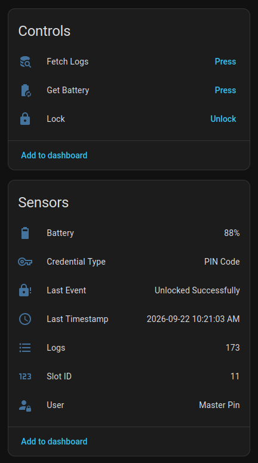
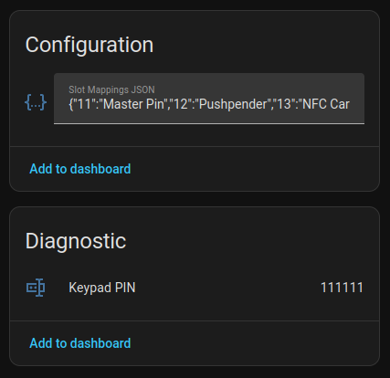

# Atomberg Smart Lock


*Custom Home Assistant integration for the **[Atomberg Smart Locks](https://atomberg.com/collections/smart-locks)** via local Bluetooth Low Energy (BLE).*

> **Note**
> This is an unofficial custom integration and is not affiliated with or endorsed by Atomberg.

---

## Tested on
- **Atomberg SL1 Pro Smart Door Lock**

---

## Features

- **Direct Local BLE Control:** Operates completely offline with end-to-end AES-128 encryption.
- **Fast Remote Unlock:** Direct unlock trigger with local auto re-lock state tracking.
- **Battery Status:** On-demand battery level polling.
- **Audit Log Sync:** Reads and parses hardware event logs, including unlock attempts, fingerprint, NFC Card scans, physical thumbturn usage, and failed/denied access attempts.
- **Credential Type:** Show the credential type used for last unlock.
- **Last Event:** Last unlock attempt was successful or failed.
- **Last Timestamp:** Timestamp of the last event.
- **User:** The user that triggered the last event.
- **Keypad Pin:** If keypad was used, shows the last pin entered.
- **Configurable Credential Mapping:** Name your registered fingerprint slots and NFC cards directly within Home Assistant via a JSON configuration text entity.
- **Persistent State:** Log history and credential maps persist across Home Assistant restarts.
- **Full UI Configuration:** Complete setup, options flow, and reconfiguration through the Home Assistant UI.

---

## Prerequisites

1. **Home Assistant 2026.3.0 or newer**.
2. A working **Bluetooth adapter / ESPHome Bluetooth Proxy** within range of your lock.
3. Your lock's BLE credentials:
   - **`LOCK_MAC`**: BLE MAC address of the lock (e.g., `AA:BB:CC:11:22:33`).
   - **`STATIC_MASTER_KEY`**: 16-byte pairing key (ASCII string or 32-character hex).
   - **`LOCK_SALT`**: 4-byte pairing salt (8-character hex, e.g., `1a2b3c4d`).

---

## Extracting Credentials (BTSnoop Log)

The easiest way to extract your `LOCK_MAC`, `STATIC_MASTER_KEY`, and `LOCK_SALT` is by capturing a single Android Bluetooth HCI snoop log while setting up the lock in the official Atomberg app:

1. Enable **Developer Options** on your Android phone.
2. Enable **Enable Bluetooth HCI snoop log**.
3. Open the official Atomberg app and setup your lock (initial setup/pairing).
4. Disable Bluetooth, then turn off the snoop log setting.
5. Enable **USB Debugging** on your Android phone.
6. Connect your phone to your computer and run:
   ```bash
   adb bugreport
   ```
   This will generate a zip file and download it to your computer.
7. Extract the zip file and retrieve `btsnoop_hci.log` from:

```text
extractedFolder/FS/data/misc/bluetooth/logs/btsnoop_hci.log

```

8. In your terminal, run the extractor tool:

```bash
# Install required crypto library
pip install -r tools/requirements.txt

# Run extractor
python3 tools/extract_keys.py btsnoop_hci.log

```

The script will output the exact `LOCK_MAC`, `STATIC_MASTER_KEY`, and `LOCK_SALT` to paste into Home Assistant.

---

## Installation

### Method 1: Using HACS

1. Open **HACS** in Home Assistant.
2. Go to **Integrations**.
3. Open the menu in the top right and select **Custom repositories**.
4. Enter `https://github.com/dreadedlama/atomberg-lock`.
5. Select **Integration** as the repository type.
6. Click **Add**, search for **Atomberg Lock**, and install it.
7. Restart Home Assistant.

### Method 2: Manual Installation

1. Using your tool of choice, open the directory for your HA configuration (where you find `configuration.yaml`).
2. If you do not have a `custom_components` directory there, create one.
3. In `custom_components`, create a new folder called `atomberg_lock`.
4. Download all files from `custom_components/atomberg_lock/` in this repository and place them inside that folder.
5. Restart Home Assistant.

---

## Configuration

1. Go to **Settings → Devices & services**.
2. Click **Add Integration**.
3. Search for **Atomberg Lock**.
4. Fill in the extracted credentials:

| Field | Description | Example |
| --- | --- | --- |
| **`LOCK_MAC`** | Bluetooth MAC address of the lock | `AA:BB:CC:11:22:33` |
| **`STATIC_MASTER_KEY`** | Master encryption key (16 ASCII chars or 32 Hex chars) | `AbCdEfGhIjKlMnOp` |
| **`LOCK_SALT`** | 4-byte Lock Salt (8 hex characters) | `1a2b3c4d` |

5. Click **Submit**. Home Assistant will authenticate directly with the lock and register the device.

---

## Entities

| Entity | Type | Description |
| --- | --- | --- |
| **Lock** | `lock` | Controls remote unlock and displays current lock state. |
| **Get Battery** | `button` | Triggers an active BLE query to refresh battery percentage. |
| **Fetch Logs** | `button` | Downloads and parses recent audit log records from the lock. |
| **Credential Type** | `sensor` | The type of credential used for the last recorded access attempt, such as fingerprint, NFC card, keypad PIN |
| **Last Event** | `sensor` | Shows the result of the last recorded access attempt, such as a successful unlock or a failed/denied attempt. |
| **Last Timestamp** | `sensor` | Date and time when the last recorded access attempt occurred. |
| **Logs** | `sensor` | Total count of audit records; attributes contain the last 10 parsed events. |
| **Slot ID** | `sensor` | Shows the numeric slot ID associated with the credential used for the last recorded access attempt, when applicable. |
| **User** | `sensor` | Shows the configured name of the user associated with the last attempt. The name is resolved from the Slot Mappings JSON configuration. |
| **Slot Mappings JSON** | `text` | Editable JSON object mapping numeric slot IDs to human-readable names. |
| **Keypad PIN** | `sensor` | Last keypad PIN entered during a keypad access attempt, when available. |

---

<div>
  
  
</div>

## Slot Mappings (Custom User Names)

The lock stores fingerprints and NFC cards by numeric slot IDs. You can map these IDs to friendly names directly via the **Slot Mappings JSON** text entity on the device page.

### Example JSON:

```json
{
  "13": "NFC Card 1",
  "14": "NFC Card 2",
  "17": "Left Thumb",
  "20": "Right Thumb"
}

```

When new logs are fetched, the integration automatically resolves slot numbers to their configured names (e.g. `Unlocked by - Left Thumb`).

---

## Changing Credentials

To update the MAC, Master Key, or Salt without deleting the integration:

1. Go to **Settings → Devices & services**.
2. Find **Atomberg Lock** and click **Configure**.
3. Enter the updated credentials and submit. The integration will test authentication and reload automatically.

---

## Troubleshooting

* **Connection failed / Timeout during setup:** Ensure Home Assistant's Bluetooth adapter or ESPHome Bluetooth Proxy is within good radio range of the lock. Verify that the official Atomberg mobile app is completely closed (BLE locks accept only one active connection at a time).
* **Invalid Lock Salt or Master Key:** Ensure your salt is an 8-character hex string without `0x` prefixes or spaces. Re-run the extraction script on a fresh BTSnoop log where an unlock command was executed.

---

## Disclaimer

This project is an independent reverse-engineered implementation and is not affiliated with or endorsed by Atomberg Technologies. Use at your own risk.
